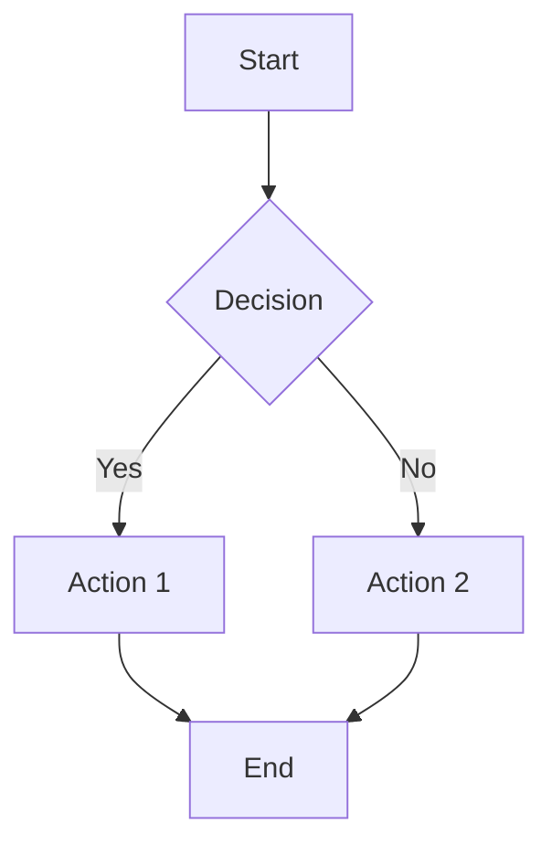
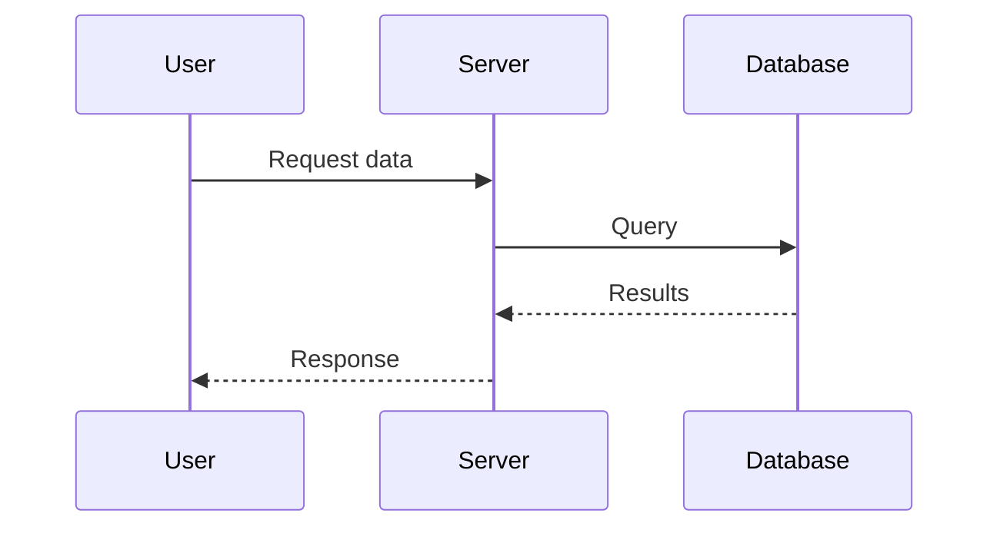
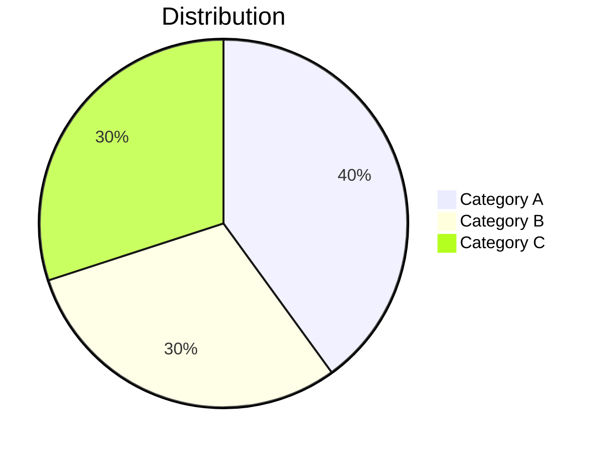
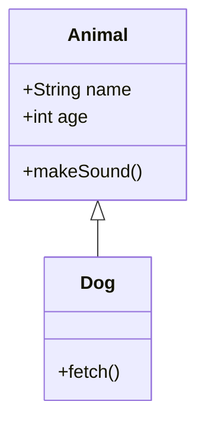
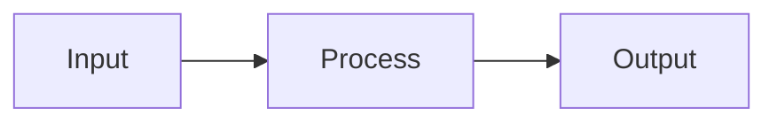

# Blog Writing Guide

This guide explains how to write and publish new blog posts on this site.

## 📍 Where to Create Posts

All blog posts go in:
```
docs/blog/posts/
```

## 🚀 Quick Start: Create a New Post

### 1. Create the File

Create a new `.md` file in `docs/blog/posts/`:

```bash
touch docs/blog/posts/my-new-post.md
```

**File naming conventions:**
- Use lowercase with hyphens: `my-awesome-post.md`
- Be descriptive but concise
- Avoid special characters

### 2. Add Frontmatter

Every post **must** start with YAML frontmatter:

```yaml
---
title: My Awesome Blog Post
authors:
  - anandgupta
date:
  created: 2026-01-26
draft: false
slug: my-awesome-post
categories: 
  - Technical
tags:
  - Python
  - Machine Learning
---
```

### 3. Write Your Content

```markdown
---
title: My Awesome Blog Post
# ... frontmatter ...
---

Write a compelling introduction paragraph here.

<!-- more -->

Everything after the `<!-- more -->` separator will be hidden 
on the blog listing page but visible on the full post.

## First Section

Your content here...
```

---

## 📋 Frontmatter Reference

| Field | Required | Description | Example |
|-------|----------|-------------|---------|
| `title` | ✅ Yes | Post title | `My Awesome Post` |
| `authors` | ✅ Yes | List of author IDs | `- anandgupta` |
| `date.created` | ✅ Yes | Creation date (YYYY-MM-DD) | `2026-01-26` |
| `draft` | ✅ Yes | `true` = hidden, `false` = published | `false` |
| `slug` | ⚡ Recommended | URL-friendly identifier | `my-awesome-post` |
| `categories` | ⚡ Recommended | Post categories | `- Technical` |
| `tags` | ⬜ Optional | Post tags | `- Python` |
| `date.updated` | ⬜ Optional | Last update date | `2026-01-27` |
| `id` | ⬜ Optional | Unique identifier | `post-001` |

### Full Frontmatter Example

```yaml
---
id: unique-post-id
title: Complete Guide to Machine Learning
authors:
  - anandgupta
date:
  created: 2026-01-26
  updated: 2026-01-27
draft: false
slug: complete-ml-guide
categories: 
  - Technical
  - Tutorial
tags:
  - Machine Learning
  - Python
  - TensorFlow
---
```

---

## 👤 Managing Authors

Authors are defined in `docs/blog/.authors.yml`:

```yaml
authors:
  anandgupta:
    name: Anand Gupta
    description: Creator
    avatar: https://avatars.githubusercontent.com/u/39819996
    url: https://anandgupta1202.github.io/
```

### Adding a New Author

```yaml
authors:
  anandgupta:
    name: Anand Gupta
    description: Creator
    avatar: https://avatars.githubusercontent.com/u/39819996
    url: https://anandgupta1202.github.io/
  
  newauthor:
    name: New Author Name
    description: Guest Writer
    avatar: https://example.com/avatar.jpg
    url: https://newauthor.com
```

---

## 🖼️ Adding Images

### Image Location

Store images in:
```
docs/blog/images/
```

### Basic Image

```markdown

```

### Image with Caption (Recommended)

```markdown
<figure markdown="span">
  { width="600" }
  <figcaption>Your caption here</figcaption>
</figure>
```

### Image with Link Attribution

```markdown
<figure markdown="span">
  { width="auto" height="auto" }
  <figcaption>
    Photo by <a href="https://unsplash.com/@photographer">Photographer</a> 
    on <a href="https://unsplash.com">Unsplash</a>
  </figcaption>
</figure>
```

### Image Sizing

```markdown
{ width="300" }     <!-- Fixed width -->
{ width="50%" }     <!-- Percentage -->
{ loading="lazy" }  <!-- Lazy loading -->
```

---

## 📊 Adding Diagrams (Mermaid)

This site supports [Mermaid](https://mermaid.js.org/) diagrams natively.

### Flowchart

````markdown

````

### Sequence Diagram

````markdown

````

### Pie Chart

````markdown

````

### Class Diagram

````markdown

````

---

## 💡 Admonitions (Callout Boxes)

### Note

```markdown
!!! note
    This is a note callout.
```

### Warning

```markdown
!!! warning "Custom Title"
    This is a warning with a custom title.
```

### Info

```markdown
!!! info
    Informational callout.
```

### Tip

```markdown
!!! tip "Pro Tip"
    A helpful tip for readers.
```

### Collapsible

```markdown
??? note "Click to expand"
    This content is hidden by default.

???+ note "Expanded by default"
    This content is visible by default but can be collapsed.
```

### Available Types

`note`, `abstract`, `info`, `tip`, `success`, `question`, `warning`, `failure`, `danger`, `bug`, `example`, `quote`

---

## 💻 Code Blocks

### Basic Code Block

````markdown
```python
def hello_world():
    print("Hello, World!")
```
````

### With Line Numbers

````markdown
```python linenums="1"
def hello_world():
    print("Hello, World!")
```
````

### Highlight Specific Lines

````markdown
```python hl_lines="2 3"
def example():
    important_line = True  # Highlighted
    another_important = True  # Highlighted
    normal_line = False
```
````

### With Title

````markdown
```python title="my_script.py"
def main():
    pass
```
````

### Inline Code

```markdown
Use `print()` to output text.
```

---

## 📑 Tables

### Basic Table

```markdown
| Column 1 | Column 2 | Column 3 |
|----------|----------|----------|
| Row 1    | Data     | Data     |
| Row 2    | Data     | Data     |
```

### Aligned Table

```markdown
| Left | Center | Right |
|:-----|:------:|------:|
| L    |   C    |     R |
```

---

## ✅ Task Lists

```markdown
- [x] Completed task
- [ ] Incomplete task
- [ ] Another task
```

---

## 🔗 Links

### Internal Links

```markdown
[Link to another post](../another-post.md)
[Link to home](../../index.md)
```

### External Links

```markdown
[External Site](https://example.com)
```

### Button Links

```markdown
[Click Me](https://example.com){ .md-button }
[Primary Button](https://example.com){ .md-button .md-button--primary }
```

---

## 📝 Complete Post Template

```markdown
---
title: Your Post Title Here
authors:
  - anandgupta
date:
  created: 2026-01-26
draft: false
slug: your-post-slug
categories: 
  - Technical
tags:
  - Tag1
  - Tag2
---

Write a compelling introduction that summarizes what readers will learn.

<!-- more -->

## Introduction

Expand on the introduction with more context.

## Main Section

<figure markdown="span">
  { width="600" }
  <figcaption>Image caption with attribution</figcaption>
</figure>

Your main content here with explanations.

### Subsection with Code

```python title="example.py" linenums="1"
def example_function():
    """Example docstring."""
    return "Hello!"
```

!!! tip "Pro Tip"
    Add helpful tips for your readers.

### Subsection with Diagram



## Conclusion

Summarize the key points and provide next steps.

---

*Have questions? Reach out on [LinkedIn](https://linkedin.com/in/anand-gupta-1202)!*
```

---

## 🔄 Publishing Workflow

### 1. Write Draft

```yaml
draft: true  # Hidden from site
```

### 2. Preview Locally

```bash
uv run --with "mkdocs-material[imaging]" mkdocs serve
```

Open http://127.0.0.1:8000 to preview.

### 3. Publish

Change frontmatter:
```yaml
draft: false  # Now visible
```

### 4. Deploy

```bash
git add docs/blog/posts/my-new-post.md
git add docs/blog/images/  # If you added images
git commit -m "Add new blog post: My New Post"
git push origin main
```

The post will be live within 1-2 minutes!

---

## 📁 File Structure Reference

```
docs/
├── blog/
│   ├── .authors.yml      # Author definitions
│   ├── index.md          # Blog landing page
│   ├── images/           # Blog images
│   │   ├── post1-image.jpg
│   │   └── post2-diagram.png
│   └── posts/            # Blog posts
│       ├── my-first-post.md
│       └── my-second-post.md
```

---

## ❓ Troubleshooting

### Post Not Appearing

1. Check `draft: false` in frontmatter
2. Verify date is not in the future
3. Ensure file is in `docs/blog/posts/`
4. Check for YAML syntax errors

### Images Not Loading

1. Verify path: `../images/filename.jpg`
2. Check file exists in `docs/blog/images/`
3. Ensure filename case matches exactly

### Build Errors

Run with strict mode to see all warnings:
```bash
mkdocs serve --strict
```
