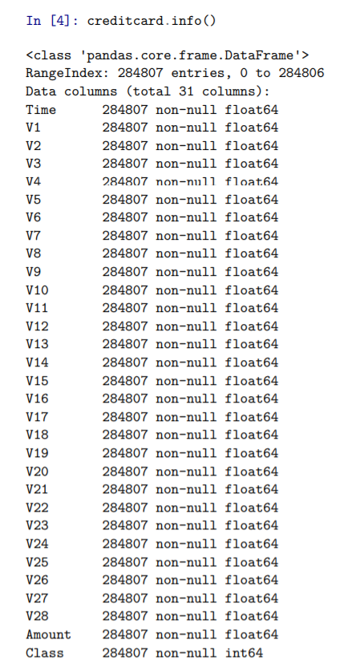

This article describes how I used different machine learning models to try to predict credit card fraud and see which works best.
<!-- more -->
<figure markdown="span">
  { width=auto height=auto}
  <figcaption>creditcard image from unsplash</figcaption>
</figure>

!!! INFO "To the reader"

    The original version of this article was written for Medium.com
    I have attempted to export my articles here.

## Motivation
Well, I am studying data science at [AAIC](https://www.appliedaicourse.com/) and as a case study, I am required to analyze and write a blog about a problem where I applied Machine Learning models to help solve the problem.

## Data Source
The data for credit card fraud case study can be found [here](https://www.kaggle.com/mlg-ulb/creditcardfraud). It is a Kaggle link from where you can download the data and work on it.

## Initial Findings (EDA)
After importing the necessary packages and reading the data into a pandas dataframe, we start analyzing it.

<figure markdown="span">
  { width=auto height=auto }
  <figcaption>credit card data info</figcaption>
</figure>

With the info() method we can see :

all the columns
all data types
whether any columns contain null or not as its values
We can also see by the numbers written beside the names that there are no missing data in any of the columns.

Next up we analyse the “time” column in the dataset.

!!! Note "Will update rest of the article soon"
    [Back to homepage](../../index.md){ .md-button }
