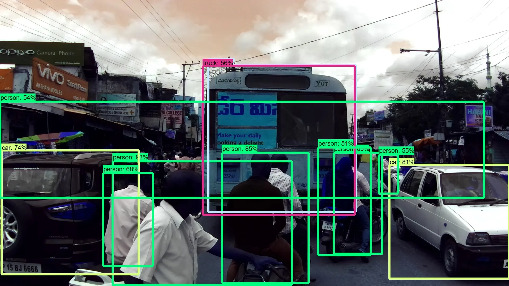
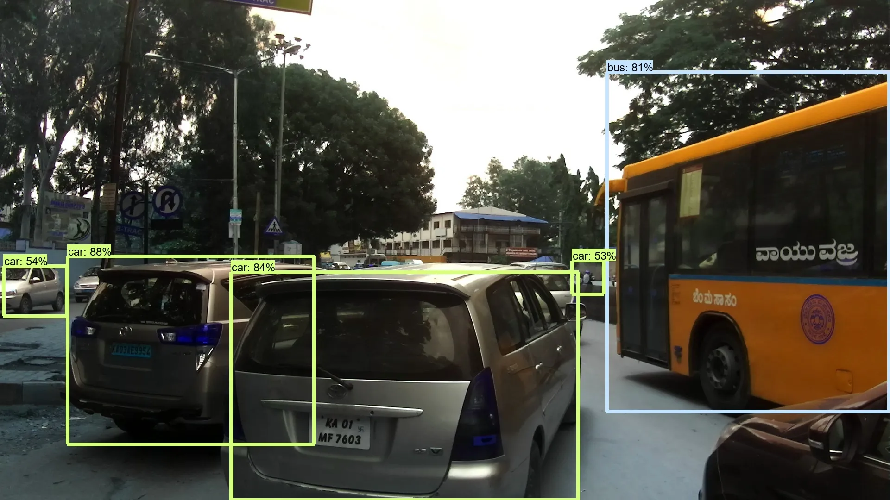
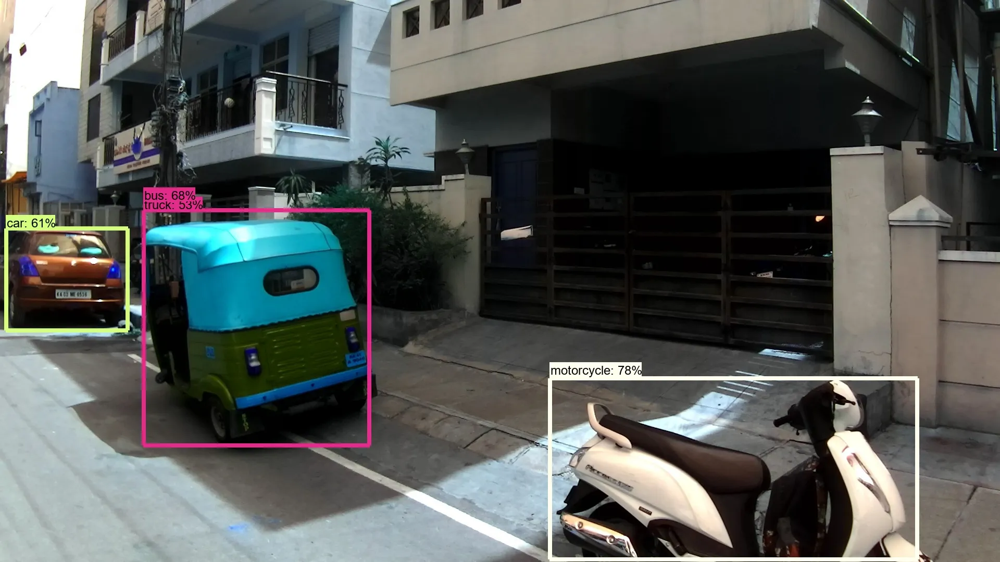

Let's see how we can use Google’s Object Detection Model on Indian roads.

<!-- more -->  
<figure markdown="span">
  { width=auto height=auto}
  <figcaption>Photo by <a href="https://unsplash.com/@atharva_tulsi?utm_content=creditCopyText&utm_medium=referral&utm_source=unsplash">Atharva Tulsi</a> on <a href="https://unsplash.com/photos/panning-photo-of-road-JltBvvxNejo?utm_content=creditCopyText&utm_medium=referral&utm_source=unsplash">Unsplash</a></figcaption>
</figure>

!!! warning "To the reader"

    The original version of this article was written for Medium.com [here](https://medium.com/@anand.gupta1202/object-detection-on-indian-roads-using-tensorflow-1cb29a3f8846)
    I have attempted to export my articles here.

## Origin:
First of all, let’s talk about the dataset. The dataset containing all the relevant data can be found here. The dataset consists of images obtained from a front-facing camera attached to a car. The car was driven around Hyderabad, Bangalore cities and their outskirts. The images are mostly of 1080p resolution, but there are also some images with 720p and other resolutions.

To download the data you click on Dataset -> Download. Before the data starts to download you have to sign in with your account.

Once, the download is complete there will be 2 folders available:

  - Detection Folder
  - Segmentation Folder
Since I am working on detecting objects, I worked on the Detection folder.

___

## Inside the folder:
Inside the detection folder, there are 3 main things:

### JpegImages Folder
This folder contains all the pictures that are extracted from the videos recorded while driving around some Indian cities.

  1. Annotation Folder — This folder contains all the annot files for each training image in a “.xml”. The annot files are in the Pascal VOC format.
  2. There are also 3 “.txt” files named — train, test, val. These files contain the relative path to each image in the folder which states whether the files will be used for train, test or val which is validation.

!!! Note 
    *I have tried to implement different executions of other models like Yolo, Yolo-v3 but since they did not work correctly, I am choosing to write only about the one that did.*

---

## Choosing what to execute:
I was reading articles before working on this project, on the Object Detection API by Google — how it is a single stop solution to implement all the major models of computer vision and decided to give it a go.

Next most important thing was to choose what model I wanted to execute to detect objects from the images.
The Object Detection API has the capability to execute many different types of models, like ssd_mobilenet_v1, faster_rcnn_resnet50 to name a few.

The complete list of models and the weights that they are trained on can be found in [Tensorflow detection model zoo](https://github.com/tensorflow/models/blob/master/research/object_detection/g3doc/detection_model_zoo.md).

Each model named here has 2 columns listed beside it. One is for “*Speed*” — how quickly can a model predict and another is “*mAP*” — which loosely translates to how accurate the model is usually (based on test conditions).
Point to note here is that there is usually a tradeoff between speed and accuracy in these models

So after reviewing all the models, I decided to go with ssd_inception_v2_coco as it provides a good trade-off between speed and accuracy.

___

## Implementing the model
Well, to be honest, the best step by step guide on how to implement the model is given [here](https://tensorflow-object-detection-api-tutorial.readthedocs.io/en/latest/training.html). The tutorial has detailed writeup on how to go about executing the model and all the best practice ways to do it like setting up a workspace.

But here are some of ***my*** pointers/learnings that I followed while working on this problem.

  - ### Don’t mess around with your original anaconda environment if you are not confident.
  I use anaconda for my projects locally and I have a bad history with goofing up the original installation of anaconda which resulted in multiple errors while using the TensorFlow with GPU. This in turn can lead to multiple resets and uninstall of PATH variables, GPU drivers, etc
  The best solution to this problem would be to make a new Conda environment for this project. I am linking an excellent blog/tutorial on how to start with this here.
  - ### There is a big flaw that I discovered much later while working with this dataset.
  As I have already discussed that the dataset consists of JPEGImages and XML files. The images and the xml files (should ideally) have a 1-to-1 relationship i.e. for every “.jpg” training image there should be a “.xml” file.
  Unfortunately such is not the scenario for the dataset provided here.
  - ### Processing and Separation of files are important due to the above-mentioned reason.
  So here is what I did. Since the images provided were of 3 types:
  
    1. Train — for training
    2. Test — for testing
    3. Val — for validation
  So I wrote a script to read the file name of every training image and check if the corresponding xml file exists. If yes, then copy both the image and xml file to another folder called “training”.
  Repeat the process for test and val, only that the test images don’t have any corresponding xml files obviously.
  - During the part where you need to install Protobuf, be careful not to install the version 3.5 or more. This will save you a lot of time by utilising the multi-file selection wildcard (i.e *.proto)
  - While converting the .xml to .csv and from .csv to .record I copy-pasted the scripts and executed them using Jupyter Notebooks. I was easy to edit and provide easy debug on the code lines. Also, I could change the way the script was talking inputs based on my new folder structure.
  - While executing the custom training of your model be sure to lower the training batch number based on your machine’s capabilities. Otherwise it may lead to errors and training will stop.

After following the tutorial to implement a ssd_inception_v2_coco model I had to test it on the images of Indian traffic/roads.

Here are some of the output images:

- Sample Image 1
  { width=auto height=30%}
- Sample Image 2
  { width=auto height=30%}
- Sample Image 3
  { width=auto height=30%}

As we can see that the model does a pretty good job of detecting relevant objects on the input images with a moderate confidence rate.

---

## End Notes:
While I did want to train on custom data (I actually did it halfway before running into a bunch of errors and dependency issues) I feel the pre-trained labels works fairly for images of Indian roads and traffic.

While work on autonomous cars have miles to go (no pun intended) before being able to tackle the chaotic and unstructured nature of Indian roads, working on object detection models are definitely the way forward.